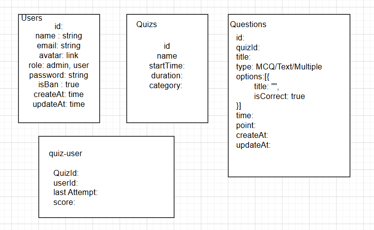

## **Features**

### Admin Panel:

1.  **Admin Authentication:**
    
    -   Admin login and logout functionality with session management.
    -   Multi-admin support (optional).
2.  **Quiz Management:**
    
    -   Add/Edit/Delete questions.
    -   Assign categories to quizzes (e.g., Math, Science).
    -   Preview quizzes before publishing.
    -   Set quiz availability (start and end date).
3.  **User Management:**
    
    -   View registered users.
    -   Ban/unban users.
    -   Reset a user’s retake timer manually.
4.  **Analytics:**
    
    -   Detailed reports on quiz attempts.
    -   Track highest and lowest scores.
    -   Filter results by quiz, date, or user.
5.  **Result Management:**
    
    -   Export results to Excel/PDF.
    -   Option to email results to multiple users at once.
    -   Real-time notifications for completed quizzes.

----------

### User Panel:

1.  **User Profile:**
    
    -   View and update personal details.
    -   Check past quiz attempts and scores.
2.  **Quiz System:**
    
    -   Quiz dashboard with available and completed quizzes.
    -   Timer and progress bar during the quiz.
    -   Show correct answers after submission (if enabled by admin).
3.  **Retake Restrictions:**
    
    -   Show countdown until the next eligible retake.
    -   Notify users via email 24 hours before they can retake.
4.  **Leaderboard:**
    
    -   Display top scorers for each quiz.
    -   Highlight the user’s rank among others.
5.  **Interactive Features:**
    
    -   Enable hint functionality for questions (optional).
    -   Feedback form for quiz quality.

----------

## **Additional Functionalities**

### Email Features:

-   Custom email templates for:
    -   Quiz invitations.
    -   Results and leaderboard notifications.
    -   Password reset.

### Notifications:

-   Push notifications (optional) for quiz updates.
-   Real-time alerts when the quiz timer is about to end.

### Security Enhancements:

-   Rate limiting to prevent brute-force attacks.
-   Encrypt sensitive data in the database.
-   CAPTCHA for login and registration pages.

### Scalability:

-   Pagination for large datasets (e.g., users, quiz results).
-   Cache frequently accessed data using **Redis**.

----------

## **Technology Stack**

### **Frontend:**

-   React.js with **Redux** or **Context API** for state management.
-   Component libraries: Material-UI + Tailwind CSS for responsive and attractive design.
-   Chart.js or Recharts for analytics visualizations.

### **Backend:**

-   Node.js with **Express.js**.
-   **Mongoose** for MongoDB operations.
-   **Socket.io** for real-time updates (e.g., quiz submission notifications).

### **Database:**

-   MongoDB with proper schema design:
    -   **Users**: Name, email, password, roles, registration date, etc.
    -   **Quizzes**: Questions, categories, time limit, availability, etc.
    -   **Results**: User ID, quiz ID, score, submission time, etc.

### **Additional Libraries:**

-   **Lodash**: Utility functions for data manipulation.
-   **Bcrypt.js**: Password hashing.
-   **Moment.js**: Date and time formatting.
-   **Nodemailer**: Email functionality.

----------

## **Backend Endpoints**

### **Admin Endpoints:**

1.  **Authentication:**
    
    -   `POST /admin/login`: Authenticate admin.
    -   `POST /admin/logout`: End admin session.
2.  **Quiz Management:**
    
    -   `POST /admin/create-quiz`: Add a new quiz.
    -   `PUT /admin/update-quiz/:quizId`: Update a quiz.
    -   `DELETE /admin/delete-quiz/:quizId`: Delete a quiz.
    -   `GET /admin/quizzes`: List all quizzes with filters (e.g., category, date).
3.  **User Management:**
    
    -   `GET /admin/users`: List all users.
    -   `PATCH /admin/ban-user/:userId`: Ban/unban a user.
    -   `PATCH /admin/reset-timer/:userId`: Reset retake timer for a user.
4.  **Results Management:**
    
    -   `GET /admin/results`: Get quiz results.
    -   `GET /admin/results/:quizId`: Get results for a specific quiz.
    -   `POST /admin/email-results`: Send results via email.

### **User Endpoints:**

1.  **Authentication:**
    
    -   `POST /user/register`: Register a new user.
    -   `POST /user/login`: Authenticate a user.
    -   `POST /user/logout`: End user session.
2.  **Quiz Interaction:**
    
    -   `GET /user/available-quizzes`: List all available quizzes.
    -   `POST /user/submit-quiz/:quizId`: Submit quiz answers.
    -   `GET /user/results`: Get user’s past results.
3.  **Profile:**
    
    -   `GET /user/profile`: Fetch user details.
    -   `PUT /user/update-profile`: Update user details.

----------

## **Project Structure**

### **Frontend:**

```
src/
├── components/
│   ├── Admin/
│   ├── User/
├── pages/
│   ├── LoginPage.js
│   ├── RegisterPage.js
│   ├── AdminDashboard.js
│   ├── QuizPage.js
│   ├── ResultsPage.js
├── store/ (if using Redux)
│   ├── actions/
│   ├── reducers/
├── App.js
└── index.js

```

### **Backend:**

```
src/
├── controllers/
│   ├── adminController.js
│   ├── userController.js
│   ├── quizController.js
├── routes/
│   ├── adminRoutes.js
│   ├── userRoutes.js
├── models/
│   ├── User.js
│   ├── Quiz.js
│   ├── Result.js
├── utils/
│   ├── auth.js (JWT middleware)
│   ├── email.js (Nodemailer setup)
├── server.js
└── config/
    ├── db.js (MongoDB connection)

```

