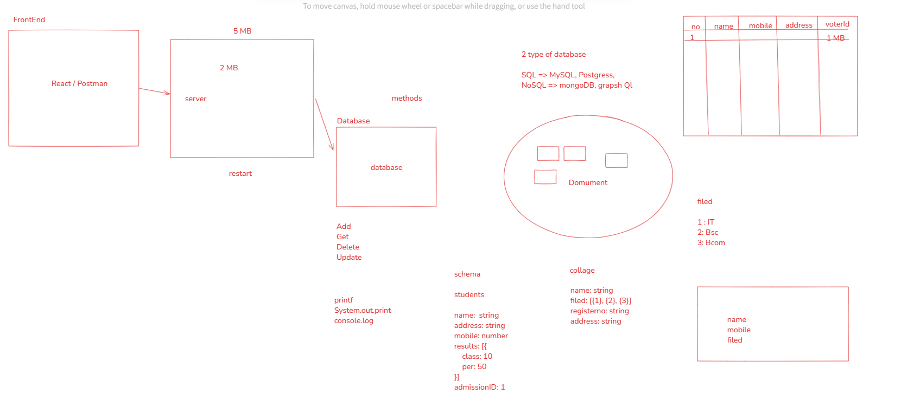

### SQL vs. NoSQL Databases

**SQL (Structured Query Language)** and **NoSQL (Not Only SQL)** are two categories of databases that differ primarily in how data is structured, stored, and accessed. Each has its advantages and is suitable for different types of applications.

### **1. SQL Databases (Relational Databases)**

SQL databases are based on a **relational model**, meaning they store data in **tables (relations)**, which consist of rows and columns. Each table has a predefined schema that dictates the structure of data. 

**Key Features:**
- **Schema-based**: SQL databases require a predefined schema that dictates how data is organized. This schema defines tables, columns, data types, and relationships between tables.
- **ACID Compliance**: SQL databases are typically ACID-compliant (Atomicity, Consistency, Isolation, Durability), which means they support reliable transactions and ensure data integrity.
- **Structured Data**: Data is typically structured, and all data must adhere to the schema.
- **Queries**: Data is queried using the SQL language, which allows complex joins, aggregations, and filtering.

**Examples of SQL Databases**:
- **MySQL**: Open-source relational database, very popular in web development.
- **PostgreSQL**: Advanced open-source relational database with support for complex queries and data types.
- **Microsoft SQL Server**: A relational database developed by Microsoft, widely used in enterprise environments.
- **Oracle Database**: A powerful and widely used enterprise database solution.

**When to use SQL:**
- When data has a fixed structure.
- For applications that require complex queries and reporting (e.g., financial applications).
- When ensuring data integrity and transactional consistency is critical.
- In applications with clear relationships between entities (e.g., users, orders, payments).

### **2. NoSQL Databases**

NoSQL databases, as the name suggests, do not rely on SQL as the primary method for querying and do not have a fixed schema. They are designed for scalability, flexibility, and speed, and they can handle a wide variety of data models like key-value, document, column-family, and graph formats.

**Key Features:**
- **Flexible Schema**: NoSQL databases do not require a fixed schema, allowing you to store data with different formats in the same collection. This flexibility is great for evolving datasets or rapidly changing data models.
- **Scalability**: Many NoSQL databases are designed for horizontal scaling, which means they can handle an increasing amount of data by distributing it across multiple servers.
- **Eventual Consistency**: Unlike SQL databases that focus on strong consistency, NoSQL databases often follow the "eventual consistency" model, where data is replicated across servers and eventually becomes consistent.
- **Data Models**: NoSQL supports various data models:
  - **Key-Value Stores** (e.g., Redis, DynamoDB)
  - **Document Stores** (e.g., MongoDB, CouchDB)
  - **Column-Family Stores** (e.g., Cassandra, HBase)
  - **Graph Databases** (e.g., Neo4j, ArangoDB)
  
**Examples of NoSQL Databases**:
- **MongoDB**: A document-oriented NoSQL database that stores data in JSON-like documents.
- **Cassandra**: A distributed column-family store known for its high scalability.
- **Redis**: An in-memory key-value store often used for caching and real-time applications.
- **Elasticsearch**: A search engine based on the Lucene library, often used for indexing large datasets and providing full-text search.

**When to use NoSQL:**
- When dealing with unstructured or semi-structured data (e.g., user profiles, product catalogs).
- For applications that need to scale horizontally to handle large amounts of data or high throughput (e.g., social networks, real-time analytics).
- In environments where the data schema is expected to evolve rapidly or if the structure of data varies significantly.
- When the application needs to be highly available and can tolerate eventual consistency (e.g., caching, logs).

### **Key Differences Between SQL and NoSQL**

| Feature                    | SQL Databases                          | NoSQL Databases                      |
|----------------------------|----------------------------------------|--------------------------------------|
| **Data Model**              | Relational (tables, rows, columns)     | Non-relational (key-value, document, column-family, graph) |
| **Schema**                  | Fixed schema                           | Flexible or schema-less              |
| **Query Language**          | SQL (Structured Query Language)        | Varies (depends on the database type)|
| **Transactions**            | ACID compliant                         | CAP theorem (Consistency, Availability, Partition Tolerance) |
| **Scalability**             | Vertical scaling (adding power to a single server) | Horizontal scaling (adding more servers) |
| **Consistency Model**       | Strong consistency (ACID)              | Eventual consistency or tunable consistency |
| **Examples**                | MySQL, PostgreSQL, Oracle, MS SQL      | MongoDB, Cassandra, Redis, Elasticsearch |
| **Use Cases**               | Structured data, transactional systems | Unstructured data, big data, real-time applications |

### **Advantages of SQL Databases**
- **Data Integrity**: ACID properties ensure data is accurate and consistent.
- **Mature and Established**: SQL databases are older and have a long history of being reliable and robust for many use cases.
- **Advanced Querying**: SQL offers powerful query capabilities for complex joins, aggregations, and subqueries.
- **Structured Data**: Ideal for applications where data is highly structured and relationships between entities are well-defined.

### **Advantages of NoSQL Databases**
- **Flexibility**: Schema-less design allows for storing unstructured or semi-structured data.
- **Scalability**: Horizontal scaling allows NoSQL databases to handle vast amounts of data and high user traffic.
- **Performance**: Many NoSQL databases are optimized for performance, especially in scenarios like real-time data processing or caching.
- **Availability**: NoSQL databases are often more available, as they are distributed and can handle partial failures without downtime.

### **When to Choose SQL Over NoSQL**
- You need to ensure strong data consistency (e.g., financial transactions).
- Your application requires complex queries or joins.
- Your data is well-structured and unlikely to change frequently.
- You're working with relational data that fits neatly into tables (e.g., e-commerce platforms).

### **When to Choose NoSQL Over SQL**
- Your application deals with unstructured or semi-structured data (e.g., JSON documents).
- You need scalability and performance at a massive scale.
- Your data model needs to be flexible and may change over time.
- You are building applications that need to handle high traffic, like social media platforms or real-time data processing.

### Conclusion

Both SQL and NoSQL databases have their strengths and weaknesses. SQL databases are best for structured data with clear relationships and high data integrity, whereas NoSQL databases excel in handling large amounts of unstructured or semi-structured data with the ability to scale horizontally. The choice depends on the specific needs of your application, including the type of data, scalability requirements, and consistency needs.

Database Download link: [text](https://www.mongodb.com/try/download/community)

